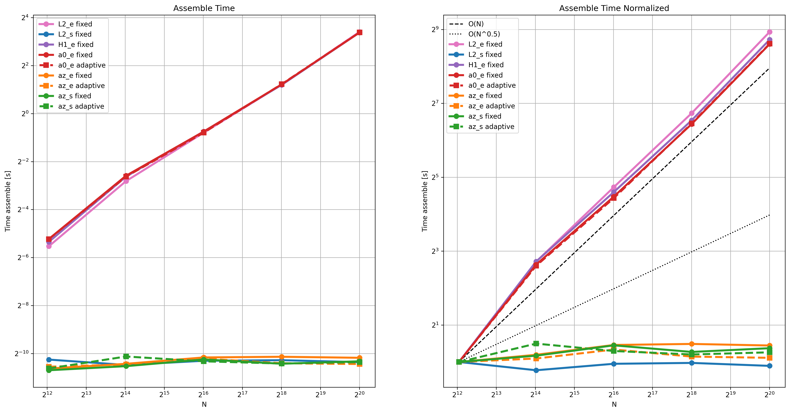
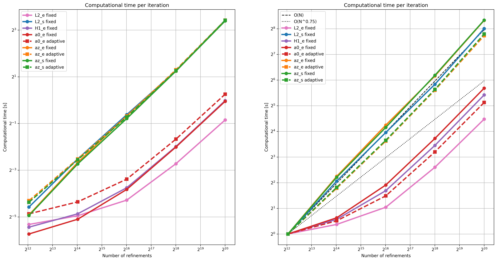

 # Test Budget
 
 Overview
 --------
 This folder produces budget CSV and publication-ready plots comparing per-iteration and assemble scomputational costs.
 By budget we intend the computational time used by every single method in order to make the comparison between them only with the number of iterations if the computational time is comparable.

 Contents
 --------
 - `compute_budget.py` — compute budget metrics for every method for the given mesh refinement and write `result.csv`.
 - `plot_budget.py` — create plots from `result.csv` for inspection and publication and computes the table reported below.
 - `Run_budget.sh` — convenience script to run the compute file multiple times.
 
 Requirements
 ------------
 - Python 3.8 or newer
 - Recommended packages: `pandas`, `numpy`, `matplotlib`, `firedrake`
 
 Quick start
 -----------
 From the repository root, to compute the budget for a single mesh refinement, run:
 
 ```bash
 python test_budget/compute_budget.py --log2h -3
 ```

 Here length of an element of the mesh is $h = 2^{-3}$. 
 For the complete test, use the script `Run_budget.sh` that launches many times the single python script with different discretization steps.
 
 ```bash
 bash test_budget/Run_budget.sh
 ```

 To visualize the results, run:
 
 ```bash
 python test_budget/plot_budget.py
 ```
 
 Results
 -------
 The different methods taken into account are:
 - $L^2$ explicit Normalized Sobolev Gradient
 - $L^2$ semimplicit Normalized Sobolev Gradient
 - $H^1$ explicit Normalized Sobolev Gradient
 - $a_0$ explicit Normalized Sobolev Gradient
 - $a_z$ explicit Normalized Sobolev Gradient
 - $a_z$ semimplicit Normalized Sobolev Gradient

 Moreover, the $a_z$ Normalized Sobolev Gradient with both discretization have been tested using the adaptive time step. The reason behind this choice is clear by the performance of the other Normalized Sobolev Gradients.

 This figure reports the time used to precompute and allocate all the quantities used in the iteration process. 



The $L^2$ explicit, $H^1$ explicit and $a_0$ explicit Normalized Sobolev Gradient reuse the same matrix at every iteration so it's factorized at the beginning. 
All other method allocate only small quantities used in the computation like the time step so the different number of refinement does not affects the computational time.

The second figure shows the computational time with respect to the number of refinements.



The three methods that have already factorized the matrix require less time even if they solve more linear system per iteration. While all other methods solve one linear system per iteration so require the same computational time. The time used by the adaptivity is dominated by the time for the linear system so in this graph cannot be seen.

Below is reported also the table with the same data. More coarse meshes have been taken into account but are not reported because the dominant time in same cases becomes the allocation of the memory instead of linear system solution. 

| method | adaptivity | h | N | time_assemble | time_step |
| --- | --- | --- | --- | --- | --- |
| H1_e | 0 | 0.000977 | 1050625 | 10.4 | 0.986 |
| H1_e | 0 | 0.00195 | 263169 | 2.29 | 0.252 |
| H1_e | 0 | 0.00391 | 66049 | 0.596 | 0.0742 |
| H1_e | 0 | 0.00781 | 16641 | 0.162 | 0.0342 |
| H1_e | 0 | 0.0156 | 4225 | 0.0246 | 0.023 |
| L2_e | 0 | 0.000977 | 1050625 | 10.6 | 0.555 |
| L2_e | 0 | 0.00195 | 263169 | 2.31 | 0.151 |
| L2_e | 0 | 0.00391 | 66049 | 0.576 | 0.0514 |
| L2_e | 0 | 0.00781 | 16641 | 0.142 | 0.0323 |
| L2_e | 0 | 0.0156 | 4225 | 0.0217 | 0.025 |
| L2_s | 0 | 0.000977 | 1050625 | 0.000762 | 10.7 |
| L2_s | 0 | 0.00195 | 263169 | 0.000805 | 2.39 |
| L2_s | 0 | 0.00391 | 66049 | 0.000792 | 0.649 |
| L2_s | 0 | 0.00781 | 16641 | 0.000702 | 0.175 |
| L2_s | 0 | 0.0156 | 4225 | 0.000819 | 0.0419 |
| a0_e | 0 | 0.000977 | 1050625 | 10.4 | 0.966 |
| a0_e | 0 | 0.00195 | 263169 | 2.32 | 0.248 |
| a0_e | 0 | 0.00391 | 66049 | 0.595 | 0.0706 |
| a0_e | 0 | 0.00781 | 16641 | 0.166 | 0.0291 |
| a0_e | 0 | 0.0156 | 4225 | 0.0267 | 0.0188 |
| a0_e | 1 | 0.000977 | 1050625 | 10.4 | 1.19 |
| a0_e | 1 | 0.00195 | 263169 | 2.34 | 0.314 |
| a0_e | 1 | 0.00391 | 66049 | 0.577 | 0.0957 |
| a0_e | 1 | 0.00781 | 16641 | 0.162 | 0.0488 |
| a0_e | 1 | 0.0156 | 4225 | 0.0266 | 0.0342 |
| az_e | 0 | 0.000977 | 1050625 | 0.000863 | 10.6 |
| az_e | 0 | 0.00195 | 263169 | 0.000889 | 2.36 |
| az_e | 0 | 0.00391 | 66049 | 0.000872 | 0.626 |
| az_e | 0 | 0.00781 | 16641 | 0.000725 | 0.157 |
| az_e | 0 | 0.0156 | 4225 | 0.000634 | 0.0331 |
| az_e | 1 | 0.000977 | 1050625 | 0.000721 | 10.7 |
| az_e | 1 | 0.00195 | 263169 | 0.000738 | 2.46 |
| az_e | 1 | 0.00391 | 66049 | 0.000842 | 0.622 |
| az_e | 1 | 0.00781 | 16641 | 0.000712 | 0.174 |
| az_e | 1 | 0.0156 | 4225 | 0.000667 | 0.0506 |
| az_s | 0 | 0.000977 | 1050625 | 0.00078 | 10.5 |
| az_s | 0 | 0.00195 | 263169 | 0.000727 | 2.36 |
| az_s | 0 | 0.00391 | 66049 | 0.000823 | 0.578 |
| az_s | 0 | 0.00781 | 16641 | 0.000678 | 0.151 |
| az_s | 0 | 0.0156 | 4225 | 0.000602 | 0.0325 |
| az_s | 1 | 0.000977 | 1050625 | 0.000761 | 10.7 |
| az_s | 1 | 0.00195 | 263169 | 0.000731 | 2.4 |
| az_s | 1 | 0.00391 | 66049 | 0.00078 | 0.606 |
| az_s | 1 | 0.00781 | 16641 | 0.000896 | 0.17 |
| az_s | 1 | 0.0156 | 4225 | 0.000635 | 0.0483 |

These numbers make more evident that the adaptivity does not require an important computational cost: increasing the mesh refinement becomes aproximatly the same with or without adaptivity.

 
 Notes
 -----
 - `compute_budget.py` and `plot_budget.py` writes its output to `test_budget/result.csv`, `test_budget/images/time_assemble.png`, `test_budget/images/time_step.png` and `test_budget/budget_table.md` by default — check the script for command-line options.
 - The plot discards by defaults the 2 coarsest meshes because too coarse in this settings, change as preferred: line 11 of `plot_budget.py`.
 
 Contact
 -------
 If something is unclear or a script fails, open an issue or message the repository maintainer.
